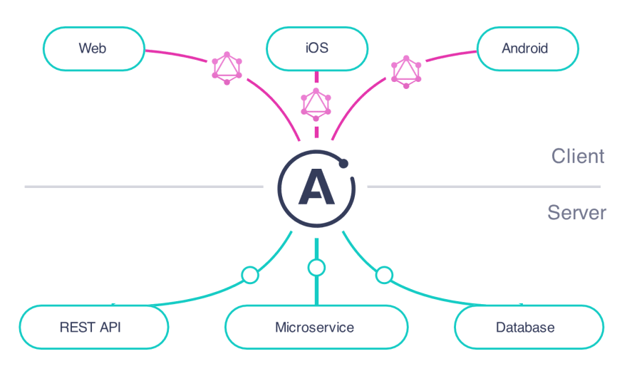
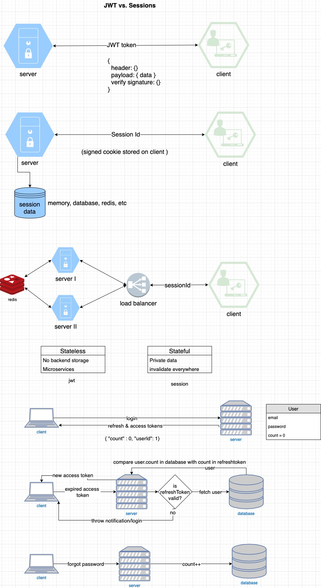

# TypeGraphQL Series

1. Setting up type-graphql
2. Register mutation
3. Validation input
4. Login mutation
5. Authorization/Middleware (basic)
6. Authorization (with roles)
7. Confirming email
8. Forgot/change password
9. Logout mutation
10. Testing with Jest
11. Higher order resolvers
12. updating...

## TypeGraphQL setup

#### 1. Installation

We use `yarn` for the project, so to start (initialize) you need to install
`yarn` and then create the project folder `mkdir typegraphql-server && cd typegraphql-server`.

Next, we need to install `express`, a Node.js framework for building server. We also
use `Apollo` libraries for writing GraphQL. Actually we use `Apollo Client`
library which support TypeScript and `Apollo Server` which is a tool to build an
API (Gateway) in Node.js



`Apollo Client` is a tool helps you write GraphQL requests in frontend. In
particular, we can write our queries, mutations as a part of the UI component
(React, React Native, Angular, Vue). Another advantage is `Apollo Client` supports state management, which
comes in very useful in big applications.

```
yarn add apollo-server-express express graphql reflect-metadata type-graphql
```

Also, we need to install the "typed" version of these packages so that we can
use with TypeScript.

```
yarn add -D @types/express @types/graphql @types/node nodemon ts-node typescript
```

#### 2. The `tsconfig.json` file

Then we create a `tsconfig.json` file to tell typescript how to compile our
code.

```JSON
{
  "compilerOptions": {
    "target": "es6",
    "module": "commonjs",
    "lib": ["dom", "es6", "es2017", "esnext.asynciterable"],
    "sourceMap": true,
    "outDir": "./dist",
    "moduleResolution": "node",
    "declaration": false,

    "composite": false,
    "removeComments": true,
    "noImplicitAny": true,
    "strictNullChecks": true,
    "strictFunctionTypes": true,
    "noImplicitThis": true,
    "noUnusedLocals": true,
    "noUnusedParameters": true,
    "noImplicitReturns": true,
    "noFallthroughCasesInSwitch": true,
    "allowSyntheticDefaultImports": true,
    "esModuleInterop": true,
    "emitDecoratorMetadata": true,
    "experimentalDecorators": true,
    "skipLibCheck": true,
    "baseUrl": ".",
    "rootDir": "src"
  },
  "exclude": ["node_modules"],
  "include": ["./src/**/*.tsx", "./src/**/*.ts"]
}
```

Now we have enough resource for starting a server at `src/index.ts`. This is an
Apollo Server, connecting to database `PostgreSQL`, or you can connect with
`REST API` you already have.

```typescript
import {ApolloServer} from "apollo-server-express";
...

const main = async () => {
// create apollo server instance
const apolloServer = new ApolloServer({
  // schemas
  // resolvers
});
}

main();
```

#### 3. `type-graphql` comes in

Our Apollo Server needs two basic elements: schemas and resolvers. Since we use
TypeScript, we have to type these elements and this is when `type-graphql` comes
in.

We will create a simple resolver, you can test with it to make sure everything
works.

- First we need to create a resolver, called `Hello Resolver`. It is a `Query`
  resolver since it just returns a string, not access to database.
- Second, pass the resolver to the Apollo Server resolvers.

```TypeScript
...
import {buildSchema, Resolver} from "type-graphql";

@Resolver()
class HelloResolver {
  @Query(() => String)
  async hello() {
    return "Hello, world!";
  }
}

const main = async () => {
  const schema = await buildSchema({
    resolvers: [HelloResolver], // an array of resolvers
  });

  const apolloServer = new ApolloServer({
    schema
  });

  const app = Express();

  apolloServer.applyMiddleware({app});

  app.listen(4000, () => console.log("server is starting on http://localhost:4000"));

}

main();
```

To start our server, go to our `package.json` file and create a script start:

```json
"scripts": {
  "start": "ts-node src/index.ts"
}
```

If you meet the error `Reflect.getMetadata` is not a function like me, we need
to import `reflect-metadata` at the top of our server file.

```typescript
import "reflect-metadata";
import {ApolloServer} from "apollo-server-express";
...
```

Now our server should be started up successfully, we can go to
`http://localhost:4000/graphql` to check the graphql playground.

#### 4. Register resolver

Create an user is a graphql resolver, not query like hello resolver, since we
need to access our database (we use PostgreSQL).

We need an ORM to transform our JavaScript/TypeScript object into table so that
we can store them in relational database. The tool we use is `typeorm` as
`type-graphql` supports very well with it.

First, we need to install `type-orm` and packages for register mutation.

```
yarn add type-orm pg bcryptjs
yarn add -D @types/bcryptjs
```

In the root directory, we create a file called `ormconfig.json` for defining the
connection how to connect to our database.

```json
{
  "name": "default",
  "type": "postgres",
  "host": "localhost",
  "port": 5432,
  "username": "your-user-name",
  "password": "your-password",
  "database": "test",
  "synchronize": true, // enable our db auto create when launch
  "logging": true, // to see sql queries in our terminal
  "entities": ["src/entity/*.*"]
}
```

If you're new with PostgreSQL, check the article for how to install, connect to,
and create use:
https://medium.com/coding-blocks/creating-user-database-and-adding-access-on-postgresql-8bfcd2f4a91e

Next, we will create a connection from our server to database with these
configs.

```TypeScript
import {createConnection} from "typeorm";

const main = async () => {
  await createConnection();
  ...
}
```

Create `User` entity:

```TypeScript
import {Entity, PrimaryGeneratedColumn, Column} from "typeorm";

@ObjectType()
@Entity()
export class User extends BaseEntity {
  @Field(() => ID)
  @PrimaryGeneratedColumn()
  id: number;

  @Field()
  @Column()
  firstName: string;

  @Field()
  @Column()
  lastName: string;

  @Field()
  @Column("text", {unique: true}) // we don't want duplicated email in db.
  email: string;

  @Column()
  password: string;
}
```

So now when we start server again, it would create table for us. The next step
is creating mutation for register user, we split the logic for CRUD tasks in
`modules/user/Register.ts` folder, instead of writing inside the `index.ts` like the hello
resolver before.

```typescript
@Resolver()
class RegisterResolver {
  @Mutation(() => User)
  async register(
    @Arg("firstName") firstName: string,
    @Arg("lastName") lastName: string,
    @Arg("email") email: string,
    @Arg("password") password: string
  ): Promise<User> {
    const hashedPassword = await bcrypt.hash(password, 12);

    const user = await User.create({
      firstName,
      lastName,
      email,
      password: hashedPassword,
    }).save();

    return user;
  }
}
```

#### 5. Validate input with `class-validator`

In a real application, when we allow user register, we also need to check
whether the information typed in input fields are legal, for example legal
email (unique or not), password length, username, etc.

We have 4 fields as parameters in register resolver, we will split these fields
into `RegisterInput` file for validation (the structure folder here is called
Fractal Pattern, you can check from the article: https://hackernoon.com/fractal-a-react-app-structure-for-infinite-scale-4dab943092af)

```typescript
@InputType()
class RegisterInput {
  @Field()
  firstName: string;

  @Field()
  lastName: string;

  @Field()
  email: string;

  @Field()
  password: string;
}
```

and in `Register` mutation, we just need 1 field which we can destruct it and
get 4 elements in the register input:

```typescript
@Mutation(() => User)
async register(
  @Arg("data") {email, firstName, lastName, password}: RegisterInput
): Promise<User> {
  ...
}
```

Now we can back to our `RegisterInput` field to validate:

```TypeScript
import {Length, IsEmail} from "class-validator";

@InputType()
export class RegisterInput {
  @Field()
  @Length(1, 30) // the first name should be length from 1 to 30
  firstName: string;

  @Field()
  @Length(1, 30) // the last name should be length from 1 to 30
  lastName: string;

  @Field()
  @IsEmail()
  email: string;

  @Field()
  password: string;
}
```

And we've done the validation for register input fields. You can come back
GraphQL Playground and try yourself.

Notice: since we move the parameters of `register` function into other file, our
register mutation in the playground should be something likes that:

```graphql
mutation {
  register(data: { firstName: "", lastName: "", email: "", password: "" }) {
    id
    firstName
    lastName
    email
  }
}
```

<b>Display error message to client</b>

If you try invalid input fields in register mutation, we would see graphql
through an error which is an array. We just need the message to send it to the
client, for example:

```
Invalid email/username/password
```

So you need to do something like "formatting errors", and `type-graphql` provide
a function that handle this task for us.

```TypeScript
...
const apolloServer = new ApolloServer({
  schema, formatError: formatArgumentValidationError
})
```

Now we back to our `RegisterInput` to config the error message for each field:

```TypeScript
@Field()
@Length(1, 255, {message: "Your message here"})
```

<b>Custom decorator</b>

Besides default decorators for checking input, we can also custom decorator for
ourselves. In this example, we need to throw an error when client register with
an already exists email (the email should be unique in our db).

```TypeScript
@ValidatorConstraint({async: true})
export class IsEmailAlreadyExistConstraint implements ValidatorConstraintInterface {
  validate(email: string) {
    return User.findOne({
      where: {email}
    })
    .then(user => {
      if (user) return false;
      return true;
    })
  }
}

export const IsEmailAlreadyExist(validationOptions? : ValidationOptions) {
  return function(object: Object, propertyName: string) {
    registerDecorator({
      target: object.constructor,
      propertyName: propertyName,
      options: validationOptions,
      constraints: [],
      validator: IsEmailAlreadyExistsConstraint
    })
  }
}
```

In our `RegisterInput`, now we can use the decorator we've just created for the
email field:

```TypeScript
export class RegisterInput {
  ...
  @Field()
  @IsEmail()
  @IsEmailAlreadyExist({message: "email already in used"})
  email: string;
}
```

For more details, we can check the docs of `class-validator`:
https://github.com/typestack/class-validator#custom-validation-decorators

#### 6. Login mutation

If register is allow user type their information, validate them and store it
into our database, login is quite a bit more complex. Since we have to check
user input, validate them and keep user login on every request, until they
logout or the login session expired.

There two common ways to handle this task, `JWT` and `session-cookie`.



In the `JWT` token method, there are 3 different parts in a token, the middle
part is the encrypted data, anyone can see the data. Compared with `session`
where we have an id (sessionId) stored usually as a cookie in client (browser).
When client makes a request, they send with the cookie in header and our server
would look up and check in session data (Redis).

When we scale up later, we may need a `load balancer` to access multiple
servers and these servers can access to a redis database.

A lot of people would call `JWT` as a stateless, means you don't need to store
any data in backend, every data is encrypted in the body of the token itself. So
we don't need to connect multiple servers to our redis since they maybe on
different cloud, area...When you need to verify `JWT` toke, you can use a
`SECRET` which you can share easily along servers. However, there are also some
downsides which means the strength of `session-cookie` method.

If we store our data/sessionId in the server (Redis), it will be more private.
The other advantage is when we need to store a bunch of data in a token, `JWT`
maybe not a good choice since it would slow down in each request. On the other
hands, `session` provides you just an id (maybe `uuid`) which would reduce the
time sending requests to the server.

There is something I learn from Ben's video:
https://www.youtube.com/watch?v=o9hT7v0OLJc&t=7s that with `JWT` token, we have
to wait until the token expire when we need to logout user or incase hacked
account. Whereas with `session`, we can actually just straight remove the data
from Redis.

In this series, we use `session` to handle user login data on every request, we
also have a version for `JWT` in the future.

Back to our series, we use `session-cookie` to store user data when they login
in Redis database. First, there are some packages we need to install:

```
yarn add connect-redis express-session ioredis cors
yarn add -D @types/connect-redis @types/express-session @types/ioredis @types/cors
```

Now we add session middleware and cors middleware to our server:

```Typescript
...
import connectRedis from "connect-redis";
import session from "express-session";

import {redis} from "./redis";

const app.use(
  cors({
    credentials: true,
    origin: "http://localhost:3000",
  })
);

const RedisStore = connectRedis(session);

app.use(
    session({
      store: new RedisStore({
        client: redis as any, // redis client we create in redis.ts
      }),
      name: YOUR_COOKIE_NAME,
      secret: YOUR_SECRET_KEY,
      resave: false,
      saveUninitialized: false,
      cookie: {
        httpOnly: true,
        secure: process.env.NODE_ENV === "production",
        maxAge: 1000 * 60 * 60 * 24 * 7 * 365, // 7 years, you can set how long you want
      },
    })
  );
```

and we have a `redis.ts` file to create an instance of Redis (ioredis) for
client to connect.

```TypeScript
import Redis from "ioredis";

export const redis = new Redis();

// We can put the connection string in Redis if we don't like the default, incase we leave it as default.
```

So we've configured the Redis session for user login task, it's time to access
and send the `sessionId` on every request. To do that, we need to pass it in
`context` of Apollo Server.

```TypeScript
const apolloServer = new ApolloServer({
  schema,
  formatError: formatArgumentValidationError,
  context: ({req}: any) => ({req}) // now we can access the object Request in all of our resolvers
})
```

Ok, now let create `login.ts` file to handle user login task. At the starting
point, you can copy/reference the file we create for register.

```TypeScript
@Resolver()
class LoginResolver {
  @Mutation(() => User, {nullable: true})
  async login(
    @Arg("email") email: string,
    @Arg("password") password: string
    @Ctx() ctx: MyContext // MyContext is the type we create for the context.
  ): Promise<User> {
    const user = await User.findOne({where: {email}});

    if (!user) return null;

    const isValid = await bcrypt.compare(password, user.password);

    if (!isValid) return null;

    ctx.req.session!.userId = user.id;

    return user;
  }
}
```

And don't forget to add `LoginResolver` into the Apollo Server in `index.ts`
file. Now you can go to the GraphQL Playground to check the login resolver,
however, you need to switch the `request.credentials` into `include` instead of
`omit`. If you see your session appears in the cookie browser, you're
successful.

#### 7. Authorization

The authorization answers the question what client can do in our system. We can
authorize by using rules like "ADMIN", "MODERATOR", "MEMBER", etc which depends
on your application business. In this series, we use a basic role: "USER" which
means the logged in users.

First, we use the `@Authorize` decorator for the field, query or mutation we
want to authorize. Here is an example:

```TypeScript
@Authorized()
@Query()
hello(): string {
  return "hello, world"
}
```

Next we need to create an auth checker function, again the roles are depends on
business logic, so we just demo the very basic example:

```TypeScript
const schema = await buildSchema({
  resolvers: [MyResolver],
  authChecker: ({root, args, context: {req}, info}, roles) => {
    return !!req.session.userId;
  }
})
```

Here is an example from type-graphql for the authorization with roles:
https://github.com/MichalLytek/type-graphql/blob/master/examples/authorization/auth-checker.ts

Now there is another way to authorize which, I think, is more flexible than the
previous method. Particularly we create middleware functions and pass them into
the `@UseMiddleware` decorator before queries, mutations you want.

```TypeScript
@UseMiddleware(isAuth)
@Query()
hello(): string {
  return "Hello, World!";
}
```

And the `isAuth` middleware can be looked like that:

```TypeScript
import {MiddlewareFn} from "type-graphql";

export const isAuth: MiddlewareFn<MyContext> = async ({context}, next) => {
  if !context.req.session!.userId throw new Error("Not authenticated");
  return next();
}
```

The method we can create other middleware like isAdmin, isModerator, etc.

#### 8. Confirm Email

In some systems, when user finish register, we send them an email to confirm the
account before they can actually log in. To do this, we have a field in the
`User` entity which contains
